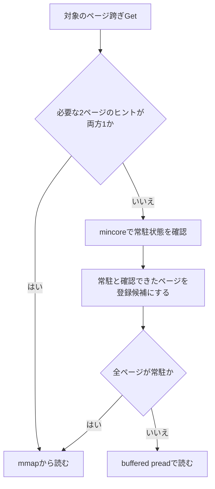

# 常駐ヒントと初期スナップショットで、Getの確認コストを減らす

2026年9月23日時点の試作を、前の会話を読まずに理解するための解説。

今回のアイデアは、**「ファイルのこのページはRAMにある」と確認した結果を小さな表に保存し、その表が使える間は、GetのたびにOSへ確認する処理を省く**ものです。OSがページを回収したら表を失効させます。また、開始時に常駐状態をまとめて調べ、既にRAMにあるページの情報を最初から表へ登録します。

狙いは、**メモリに収まらないデータを読む性能を維持しながら、メモリに収まる場合の余計な確認コストを減らすこと**です。以下では、この仕組みを「初期スナップショット付き常駐ヒント」と呼びます。

## 1. 最初に区別したい「Get Hit」と「RAMにある」

`Get(key)`は、指定したキーに対応する値を取り出す操作です。**Get Hitは、そのキーがDBに存在するという意味**です。値がRAMにあるかどうかは別の話です。

たとえば、DBにはキー`A`が存在していても、その値がRAMから追い出されていれば、取得時にストレージから読む必要があります。これもGet Hitです。

Linuxは、ファイルの内容の一部をRAMに保存します。この領域を**ページキャッシュ**と呼びます。ファイルを再び読むとき、必要な内容がここにあれば、ストレージへの読込みを省けます。

今回の環境では、ファイルの常駐状態を**4KiB＝4096Bのページ**単位で扱います。1KB値は1024Bですが、RAMにあるかどうかを調べる単位はページです。

| 言葉 | この文書での意味 |
|---|---|
| 常駐 | 必要なファイルページがRAMにある状態 |
| 非常駐 | 必要なファイルページがRAMにない状態 |
| 回収 | OSがメモリを空けるため、ページキャッシュなどからページを取り除くこと |
| 常駐条件 | 測定対象のデータをRAMに保持できる条件 |
| LTM（Larger Than Memory） | データ量が利用可能なメモリ予算を上回り、全体をRAMに保持できない条件 |

LTMでも、よく読むページがRAMにあることはあります。**常駐・非常駐は、DB全体に一つ付く属性ではなく、個々のページについて変わる状態**です。

## 2. なぜ1KBのGetで「2ページ」が問題になるのか

VMemKVでは、T1の索引からデータの場所を探し、必要に応じてT2のファイルからレコードを読みます。今回の対象は、checkpointで確定した、内容が書き換わらないT2の**不変base領域**です。

測定した1KB値のレコードには、値以外の情報も付いています。

```text
ヘッダー24B ＋ キー16B ＋ 値1024B ＝ 1064B
```

レコードを隙間なく並べると、1レコードがページの境界をまたぐことがあります。ファイル先頭から4000Bの位置に1064Bのレコードがある場合を考えます。

```text
ページ0：ファイル内の位置 0 ～ 4095
                              [レコードの先頭96B]
ページ1：ファイル内の位置 4096 ～ 8191
          [レコードの残り968B]
```

先頭ページには`4096 − 4000 = 96B`しか残っていないので、残りは次のページに置かれます。レコードを読むには、両方のページが必要です。

コード上の`offset`は「ファイル先頭から何Bの位置にあるか」、`offset % 4096`は「そのページの先頭から何B進んだ位置か」です。`%`は割り算の余りを求めます。

実装では、T1にある長さ情報から作った`size_hint`を使って読取り範囲を求めます。これは余裕を含む目安で、値の長さ1024Bそのものではありません。したがって、境界判定も「値だけ」ではなく、**レコードを読むための見積もり範囲**に対して行います。

## 3. 基準となる読取り方法と、その負担

この話に登場する三つの処理を整理します。

| 処理 | 役割 | 今回、気にしている負担 |
|---|---|---|
| `mmap`から読む | ファイルを対応付けたメモリアドレスを参照する | 必要なページがなければ、ページフォールトをきっかけに読込みを待つ |
| buffered `pread` | ファイルの指定位置・長さを指定して、バッファへ読む | システムコールとコピーが必要。ページキャッシュも利用する |
| `mincore` | 指定範囲の各ページが常駐しているかを調べる | OSへの問い合わせと、対象範囲を調べる処理が必要 |

`pread`は指定した位置からバッファへ読み、実際に読めたバイト数を返します。今回のコードはその結果やレコードの長さを検証します。[Linuxのpreadマニュアル](https://man7.org/linux/man-pages/man2/pread.2.html)

`mincore`はページごとの常駐結果を返します。ただし、その結果は確認時点の状態で、呼出しから戻るまでにも変わり得ます。[Linuxのmincoreマニュアル](https://man7.org/linux/man-pages/man2/mincore.2.html)

今回の土台である**基準方式（案1）**は、ページをまたぐ小レコードを次のように読みます。

```text
mincoreで必要なページを確認
    ├─ 全ページが常駐 → mmapから読む
    └─ 非常駐ページがある → buffered preadで読む
```

この方式は、LTMでページをまたぐレコードを読む性能を改善しました。一方、データが常駐している場合にも`mincore`を呼ぶため、その費用でGetが遅くなる条件がありました。

**今回減らしたいのは、この「毎回同じ常駐状態を問い合わせる費用」です。** 値が非常駐だった場合の読込み方法は、基準方式を引き継ぎます。

なお、RAMにデータがあることと、そのプロセスから参照するためのページテーブルが準備されていることも別です。常駐ヒントがあっても、mmap参照に伴う処理が必ずゼロになるわけではありません。

## 4. ページごとの確認結果を、小さな表へ保存する

たとえば、次のような表を持ちます。

| ファイルのページ番号 | 常駐ヒント |
|---|---|
| 100 | 1：常駐を確認済み |
| 101 | 1：常駐を確認済み |
| 102 | 0：使える確認結果がない |

ページ100と101にまたがるレコードなら、両方のヒントが1なので、`mincore`を省いてmmapから読めます。

ここで重要なのは、**0は「非常駐だと分かっている」ではなく、「常駐だと言うための情報がない」**という意味であることです。0でも、実際のデータはRAMにあるかもしれません。そのため、0を見ただけで即座に`pread`へは進まず、基準方式の`mincore`へ戻ります。



登録候補は、後述する競合チェックを通った場合だけ表に反映します。`mincore`の失敗やレコード検証などの例外処理は既存処理を使います。

今回の対象は、不変baseにある、読取り範囲が4096B以下で2ページにまたがる小レコードです。ページ内に収まるレコードや、T1に直接入る8B値に、この確認表を使う処理を追加してはいません。

### 表に保存するのは、値そのものではない

「ページ100の内容」を別のキャッシュへコピーするわけではありません。保存するのは「ページ100の常駐を確認した」という小さな情報です。

0と1を並べた表を**ビットマップ**と呼びます。1ビットで1ページを表せるので、小さくできます。実際の試作では、64ページごとに次の情報を持ちます。

| 情報 | 大きさ | 役割 |
|---|---:|---|
| 常駐ビット | 64bit＝8B | 64ページ分の常駐ヒント |
| 再登録禁止ビット | 64bit＝8B | 回収中のページへ古い確認結果を書き戻さないための情報 |
| 世代番号 | 64bit＝8B | 確認中に状態が変わったかを調べる番号。64ページで共有 |
| 合計 | **24B** | **64ページ分の管理情報** |

今回の1,716,438ページでは、管理本体は**643,680B、約0.614MiB**です。値を保存するキャッシュは増やしませんが、この管理メモリとBPF等の管理費は増えます。

ヒントが両方1なら、通常は一つの64bitの読取りで判定します。64ページの管理区切りをまたぐ場合は二つ読みます。**ヒットするたびに世代番号や再登録禁止を全部調べる実装にはしていません。** それらは主に確認結果を登録するときに使います。

## 5. 表が古くなる問題を、BPFによる失効で扱う

一度RAMに入ったページも、LTMではOSに回収されます。表を更新しなければ、「常駐確認済み」という情報だけが残ってしまいます。

そこで、OSのページキャッシュへの追加・削除のイベントを利用します。**BPF**は、カーネル内の決められた場所で小さな処理を実行するための仕組みです。今回はページキャッシュのイベントを観測し、対象ファイルのページに対応する管理情報を更新します。

```text
ページ101を回収するイベント
    ↓
BPFが対象T2ファイルかを確認
    ↓
ページ101の常駐ヒントを失効
    ↓
次にページ100・101を使うGetはmincoreへ戻る
```

ファイルの識別にはデバイス番号とinode番号、ページの識別にはファイル内のページ番号を使います。inode番号は、ファイル名とは別にOSがファイルを識別する番号です。

この表は**BPF map**という共有可能な領域に置き、アプリケーション側にもmmapします。Getでは共有メモリ上の表を読みます。GetごとにBPFへ問い合わせるシステムコールは追加しません。LinuxのBPF配列mapは、`BPF_F_MMAPABLE`を使ってこの共有ができます。[LinuxカーネルのBPF map説明](https://docs.kernel.org/bpf/map_array.html)

ここには二つのmmapが登場します。**T2のmmapはデータを読むため、BPF mapのmmapは確認表を共有するため**です。

また、ページが再追加されたイベントだけでは、常駐確認済みの1にはしません。表を「再び確認・登録できる未知状態」へ戻し、その後の`mincore`結果で登録します。

## 6. 初期スナップショットが必要だった理由

ここまでの仕組みでも、表が最初は空だと、次の状態が起こります。

```text
実際のデータ：RAMにある
確認表      ：まだ知らない

Get → 表を見る → 0なのでmincore → 常駐を確認 → 登録 → mmap
```

この最初のGetでは、`mincore`を省けません。むしろ表の参照と登録が追加されます。得をするのは、登録済みのページを後から再利用するときです。

今回のデータは約826万キーです。Uniformは各キーを同じ確率で選ぶため、100万Getしても、表が十分埋まるとは限りません。さらに、今回の表に登録するのは主にページ跨ぎGetの確認時で、**通常のmmap経路で読んだだけでは登録されません。**

実際、空の表での常駐Uniformの確認では、対象208,357 Getのうち`mincore`を省けたのは12,637回、約6.07%でした。この条件では登録漏れや保持の不備は見つからず、対象経路でまだ確認していないページが多い状態でした。

そこで、Getを開始する前に**現在の常駐状態をまとめて取得する初期スナップショット**を作ります。

```text
BPFの監視を開始
    ↓
使用済み不変baseの常駐状態を、範囲ごとにmincoreで取得
    ↓
常駐と確認でき、競合チェックを通ったページだけ登録
    ↓
Getを開始。以後は既存の学習とBPFによる失効を使う
```

ここでの「スナップショット」は常駐状態の記録です。DBのデータを保存するcheckpointとは異なり、値のコピーを作る操作でもありません。

### 4MiB分を調べることと、4MiBを読み込むことは違う

今回の試作は、1024ページ＝4MiB分の常駐状態を1回の`mincore`で取得します。結果は1ページにつき1Bなので、常駐結果用の配列は1024Bです。世代番号を保存する配列128Bも使い、これらを繰り返し再利用します。

調べるのは使用済みの範囲だけです。大きく予約した未使用領域までは走査しません。また、結果はページごとに保存するので、4MiB中に非常駐ページが一つあっても、ほかの常駐ページは登録できます。

範囲を順番に調べるため、全ページの同じ瞬間の状態を一度に固定する操作ではありません。走査中もBPFの監視を続け、登録時の競合チェックを行います。

この処理はページテーブルやページキャッシュの状態を調べます。**対象T2データをストレージから読み込み、RAMへ押し込む処理は追加していません。** Linux 5.15の実装でも、この確認経路を参照できます。[Linux 5.15のmincore実装](https://raw.githubusercontent.com/torvalds/linux/v5.15/mm/mincore.c)

ただし、走査と登録にはCPU時間がかかります。対象範囲が大きくなれば費用も増え、1回で全体を定数時間で確認できるわけではありません。

## 7. 確認と回収が同時に起きた場合

表の1を0へ消すだけでは、次の順序に対応できません。

```text
アプリ：mincoreで「常駐」を確認
OS/BPF：そのページを回収し、ヒントを0にする
アプリ：先ほどの確認結果を使い、ヒントを1に戻す
```

最後の登録で古い情報が復活してしまいます。これを避けるために使うのが、世代番号と再登録禁止です。

**世代番号は「この64ページのどこかで状態が変わった回数」を表す番号**と考えると分かりやすくなります。

```text
確認前：世代番号が10だったので保存
確認中：BPFのイベントで世代番号が11になる
登録前：10と11が違う → その確認結果の登録を諦める
```

試作ではmincoreより前に世代番号を取得し、登録前後に世代と再登録禁止を確認します。登録後の確認で競合を見つけたら、登録を取り消します。初期スナップショットも同じ仕組みを使います。

再登録禁止が別に必要なのは、削除イベントが実際の削除完了より前に発生するためです。その短い間にmincoreを呼ぶと、まだ常駐と見える可能性があります。削除通知を受けたページには禁止印を付け、再追加の通知まで新たな登録を拒否します。[Linux 5.15の削除処理](https://raw.githubusercontent.com/torvalds/linux/v5.15/mm/filemap.c)

共有ビットの更新にはatomic操作を使います。これは、複数のCPUが同じ管理領域を更新しても、別ページへの変更を単純に上書きして消さないための操作です。ただし、atomicにビットを書くだけで、上の「古い確認結果を後から登録する」という順序の問題まで解決するわけではありません。

### それでも「絶対に常駐している証明」にはしない

ヒントを読んだ直後に回収されることはあります。また、登録から後検査までの間に、一時的に古いヒントが見える余地も残ります。

この試作は、その場合も不変baseの通常のmmap読取りへ進み、必要ならページフォールトでデータを取得します。**ヒントは読取り方法を選ぶために使い、データの内容を決めるためには使いません。** この説明は、対象ファイルとmmapが有効で、内容が不変であるという試作の前提に依存します。

逆に、同じ64ページ群の別ページでイベントが起きたために、有効な登録を諦めることもあります。その場合は余計にmincoreへ戻ります。競合を扱う仕組みは入れましたが、あらゆる並行実行について厳密な保証を示した試作ではありません。

## 8. この構成で何が確認できたか

評価で分けたい比較対象は二つあります。

- **基準方式（案1）との比較**：LTMの性能を保ち、常駐時の確認コストを減らせたか。
- **案1適用前の元実装との比較**：案1で生じた常駐時の低下を、元の水準まで回復できたか。

throughputは1秒に何回Getできるかを表し、高いほど高速です。以下は各版2回の平均です。

### 基準方式（案1）と比べた結果

| 条件 | 1スレッド | 16スレッド |
|---|---:|---:|
| 常駐 Uniform | +3.61% | +4.60% |
| 常駐 Zipf | +3.14% | +4.44% |
| LTM Uniform | +0.88% | −0.60% |
| LTM Zipf | −0.20% | −0.83% |

Uniformは各キーを均等に、Zipfは一部のキーを集中的に読む分布です。常駐4条件は2回とも改善しました。LTMは概ね基準方式の水準を保っていますが、小さな低下は残っています。LTM Uniform・1スレッドは反復で増減が逆転しており、明確な改善とは扱いません。

### 元実装と直接比べた、常駐条件の結果

| 条件 | 1スレッド | 16スレッド |
|---|---:|---:|
| 常駐 Uniform | −1.78% | +1.58% |
| 常駐 Zipf | −0.68% | −0.47% |

Uniform・1スレッドは反復別で−3.46%／−0.05%とばらつきがあり、安定して1.78%低下するとまでは言えません。二つの表は独立した比較なので、改善率を足したり掛けたりして元実装比を推定しません。

**確認できたのは「LTM性能を概ね維持し、常駐時の低下の多くを回復した」ことです。「全条件で劣化を解消した」とはまだ言えません。**

### 初期化の費用と、省略できた割合

常駐Uniform・1スレッドの別の固定回数実験では、初期化後の対象208,357 Getすべてでmincoreを省略できました。分母はページ跨ぎの対象Getであり、全Getではありません。

この実験のスナップショット作成は約5.15ms、BPFロード等を含む追加初期費用は約7.13msでした。その費用と100万Getの合計は、基準方式の約3.148秒に対して約3.052秒で、初期費用を含めても短縮しました。共通のDB復元や事前のデータ常駐化は、この時間に含めていません。

一方、8条件の比較では、LTMを非常駐から開始したため、スナップショットで最初に登録できたページは0でした。初期化には約26〜29msかかり、その後はGetを通じて学習しています。**LTMでも初期化だけで表が埋まり続ける、という結果ではありません。**

測定はXeon Gold 5418N、Linux 5.15.0-186-generic、約826万キー（16Bキー、80%が1024B値、20%が8B値）で実施しました。常駐のメモリ制限はHigh/Max＝16/32GiB、LTMは1/2GiB。管理表とBPFローダーも同じ予算に含めています。8条件比較と元実装比較は既存Google Benchmarkを使用し、上の100万Get固定実験とは絶対速度を合算していません。

## 9. 得られるものと、支払う費用

| 得られるもの | 伴う費用・制約 |
|---|---|
| 確認済みページのGetでmincoreを省ける | Getにはヒント参照・分岐が加わる。未登録なら確認と登録も必要 |
| 既に常駐するページを開始時にまとめて登録できる | 使用済み範囲を走査する初期費用がある |
| 回収されたページのヒントを失効させられる | BPFのロード権限、カーネルとの対応、イベント処理が必要 |
| 1KB値を別キャッシュへコピーせずに済む | 管理本体約0.614MiBと、BPF等の管理メモリは必要 |
| ページ単位で状態変化に追従する | 常駐を固定しないため、ヒントが古くなる窓は残る |

ページが回収・再追加される変化には、BPFとGet時の再確認で追従します。利用者が常駐条件かLTMかを手動指定して読取り方式を切り替える設計ではありません。

ただし、現在は**一つの固定checkpointを読む実験用の試作**です。DBの拡大に伴う管理範囲の更新、checkpointの切替、新しいファイルへの監視の付替え、複数Storeの寿命管理などは製品用に実装していません。初期スナップショットは各プロセスで一度だけで、定期的な全体再確認も行いません。

データの保存形式は変更していません。今回追加した確認表は実行時の管理情報ですが、通常の更新・checkpoint/recovery全体へ組み込んだ実装を検証したわけではありません。

## 実装と測定記録を読む場合

この文書の説明に対応する主なファイルです。

| ファイル | 読める内容 |
|---|---|
| [page_residency_bitmap.hpp](../../benchmark/prototypes/page_residency_bitmap.hpp) | `observe`でヒント参照、`confirm_bits`で競合を確認しながら登録 |
| [page_residency_bitmap.bpf.c](../../benchmark/prototypes/page_residency_bitmap.bpf.c) | ページの追加・削除イベントに応じた失効・世代更新 |
| [page_residency_snapshot.hpp](../../benchmark/prototypes/page_residency_snapshot.hpp) | `snapshot`で範囲ごとの常駐確認と初期登録 |
| [実験コピーのread_path.hpp](../../benchmark/prototypes/audit/page-residency-snapshot/source/snapshot/read_path.hpp) | Getからヒント参照・mincore・mmap/preadへ進む経路 |
| [測定条件・結果の記録](20260923_page_residency_snapshot.md) | 各比較の生の数値、実行条件、初期化時間、判断範囲 |

作業ブランチは`codex/page-residency-snapshot`です。今回説明した常駐ヒントと初期化は実験用ソースコピーにあり、通常の製品ソースに入っているのは基準方式（案1）の条件変更だけです。このブランチの監査用保存に、試作・文書と[測定済みコード・結果](../../benchmark/prototypes/audit/page-residency-snapshot/README.md)を含めています。mainには未反映です。
